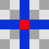
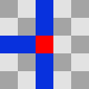
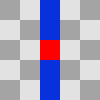
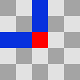
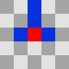
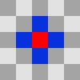
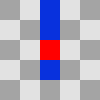
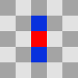

# Match 3 Game

This is a test match 3 game that I developed over a period of three days.
The game involves matching three or more similar elements.
While the core functionality is in place, I acknowledge that the design,
animation, and overall aesthetic of the elements can be improved.
Unfortunately, I do not have access to a designer at the moment.

# Unity Version 2022.3.8f1

# Features

- Match three or more similar elements.
- Simulation of 'N' player turns (N is configurable). You can run with animation or without animation.
- Adaptive Game Board. You can configure the size of the board and number of colors.
- You can use any resolution for the game board. The game board will automatically adjust to the resolution.

# Simulation
if you going to run the game in simulation mode, you have to configure field size, number of colors and number of turns.
If it without simulation mode, it might take ~40 seconds to finish simulation for 1 000 000 turns.

## Explanation
For game I used 8 patterns for detecting matches. All of them can be rotated and flipped.
### Pattern 1
 

### Pattern 2

### Pattern 3

### Pattern 4

### Pattern 5

### Pattern 6

### Pattern 7

### Pattern 8

